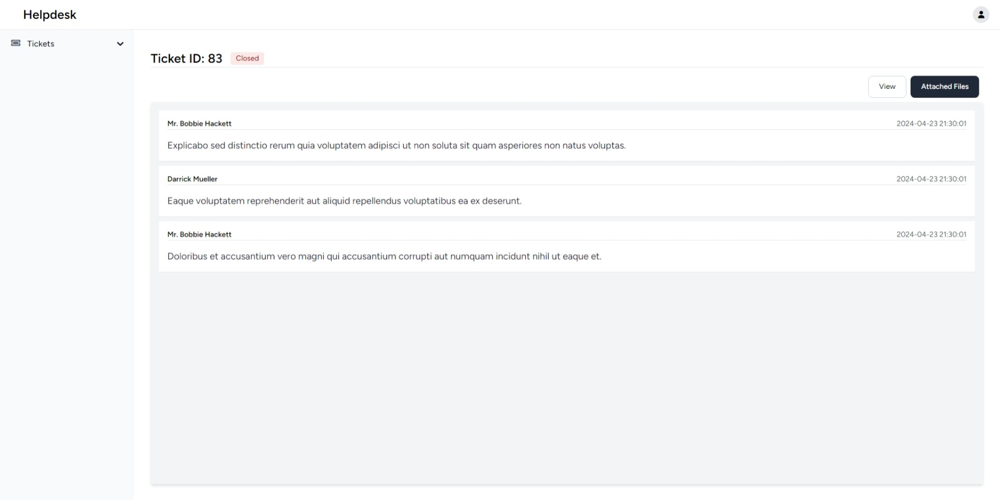
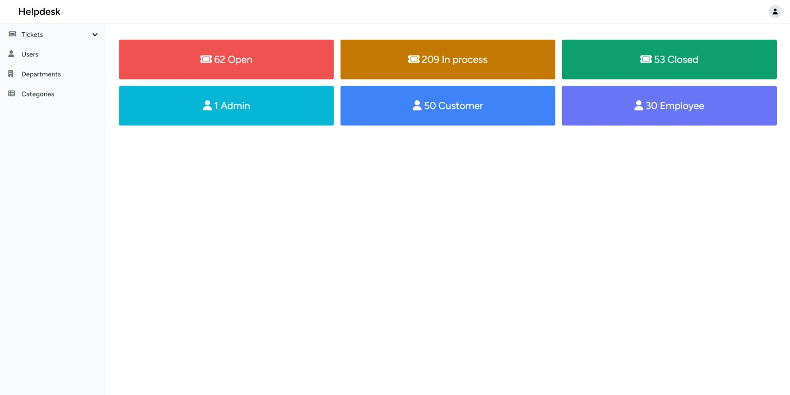

# Ticket support system

Simple ticket support system with [Laravel](https://github.com/laravel/laravel)
10, [Livewire](https://livewire.laravel.com/), [PowerGrid](https://github.com/Power-Components/livewire-powergrid)
tables, [Wire elements](https://github.com/wire-elements/modal) modals and [Breeze](https://github.com/laravel/laravel)
authentication kit.






## Setup

This project was built with Sail, but you can run this demo without it.

### Without Sail

To run this project without sail you need to have installed a web server software like XAMPP, WAMP, Laragon, etc. Then
you have to clone this repository on your web server folder and run the following commands:

1. `composer install`
2. `npm install`
3. `cp .env.example .env`
4. `php artisan key:generate`
5. `php artisan migrate`
6. `php artisan serve` you can skip this command if you are using laragon.
7. `npm run dev` open another terminal and run this command.
8. `php artisan db:seed`

### With Sail

To run this project with sail you need to have installed Docker and Docker. Windows users clone this project on WSL2 for
better performance.

1. `sail up -d` to start the containers in case the alias doesn't work use `./vendor/bin/sail up -d`.
2. `sail composer install`
3. `sail npm install`
4. `cp .env.example .env`
5. `sail artisan key:generate`
6. `sail artisan migrate`
7. `sail npm run dev`
8. `sail artisan db:seed`

## Usage

Setup last instruction calls the database that generates fake data for all models.
The seeder creates 81 users(admin included), 7 departments, 35 categories and 300 tickets where each ticket
has 3 comments.
You might want to log in as a client and an agent to see the different views,
in that case, you can retrieve user types 1 and 2 from your
database manager; all user's passwords are "password".
You can retrieve user and admin with the following commands on tinker terminal.

This command will retrieve a user with open,in process and closed tickets.

```shell
$user = App\Models\User::whereHas('tickets', function ($query) {
    $query->where('status', 0); 
})->whereHas('tickets', function ($query) {
    $query->where('status', 1); 
})->whereHas('tickets', function ($query) {
    $query->where('status', 2);
})->first();
```

And this one will retrieve a random agent.

```shell
$employee = App\Models\User::where('type', 2)->inRandomOrder()->first();
```

## Seeder settings

You can modify all seeders default values to fit your needs.

### Departments and Categories

These seeders hard hardcoded,
you can add more departments by adding more elements to the ``$departments`` and ``$categories`` array in
``DepartmentSeeder.php`` and ``CategorySeeder.php`` files.

### Users

User types 0, 1, 2 are reserved for admin, client, agent respectively.
As you can see in the code below, the seeder creates
50 clients and 30 agents.
The agents are assigned to a random department.

```php
User::factory(50)->create(['type' => 1]);
$departments = Department::all();
User::factory(30)->create(['type' => 2])->each(function ($user) use ($departments) {
    $user->department_id = $departments->random()->id;
    $user->save();
});
```

### Tickets

This seeder creates 300 tickets,
the first ticket static method takes 200 tickets and assigns them to a random agent with status of 1(in process),
while the second one takes 50 unassigned tickets with status 2(closed).

```php
Ticket::inRandomOrder()->take(200)->get()->each(function ($ticket) use ($departments) {
    $ticket->status = 1;
    $ticket->assigned_agent()->attach($ticket->category->department->users->random());
    Log::info('TicketSeeder: Updated status to 1 for ticket id: ' . $ticket->id);
    $ticket->save();
});
Ticket::whereDoesntHave('assigned_agent')->take(50)->get()->each(function ($ticket) use ($departments) {
    $ticket->assigned_agent()->attach($ticket->category->department->users->random());
    $ticket->status = 2;
    Log::info('TicketSeeder: Updated status to 2 for ticket id: ' . $ticket->id);
    $ticket->save();
});
}
```

### Comments

This seeder generates seven comments for each of the tickets that have an assigned agent and are not closed.

```php
$tickets = Ticket::whereHas('assigned_agent')->where('status', '!=', 0)->get();
Comment::withoutEvents(function () use ($tickets) {
    $tickets->each(function ($ticket) {
        for ($i = 0; $i < 7; $i++) {
            $commentData = Comment::factory()->make([
                'user_id' => $i % 2 == 0 ? $ticket->user_id : $ticket->assigned_agent()->first()->id,
            ])->toArray();
            $ticket->comments()->create($commentData);
        }
    });
});
```

