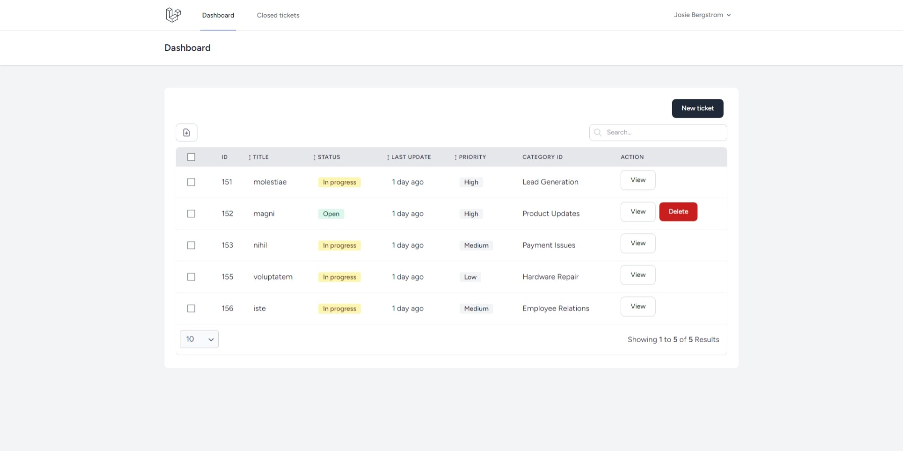
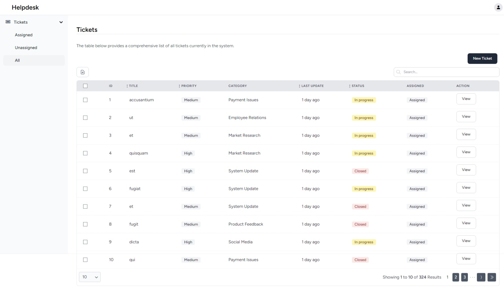

# Ticket support system

Simple ticket support system with [Laravel](https://github.com/laravel/laravel)
10, [Livewire](https://livewire.laravel.com/), [PowerGrid](https://github.com/Power-Components/livewire-powergrid)
tables, [Wire elements](https://github.com/wire-elements/modal) modals and [Breeze](https://github.com/laravel/laravel)
authentication kit.

## Setup

This project was built with Sail, but you can run this demo without it by cloning the project into your
local server like XAMPP or Laragon and replace "sail" with "php" in the commands below.

1. `git clone https://github.com/edu192/laravel-support-tickets-system.git`
2. `cd laravel-support-tickets-system`
3. `sail composer install`
4. `cp .env.example .env`
5. `sail artisan key:generate`
6. `sail artisan migrate`
7. `sail npm run dev`
8. `sail artisan db:seed --class=DepartmentSeeder`
9. `sail artisan db:seed --class=CategorySeeder`
10. `sail artisan db:seed --class=UserSeeder`
11. `sail artisan db:seed --class=TicketSeeder`
12. `sail artisan db:seed --class=CommentSeeder`

All user passwords are 'password' and the admin email is 'admin@gmail.com'.